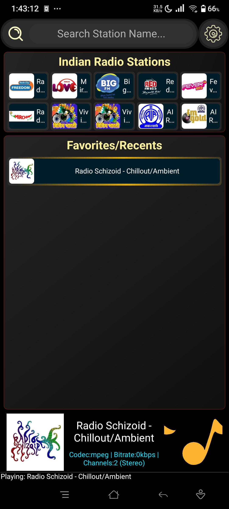
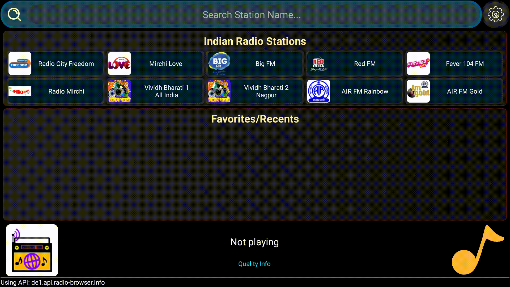

  
[![Contributors][contributors-shield]][contributors-url]
[![Forks][forks-shield]][forks-url]
[![Stargazers][stars-shield]][stars-url]
[![Issues][issues-shield]][issues-url]
[![GPL-3.0 License][license-shield]][license-url]

<!-- PROJECT LOGO -->
 

  

  <h3 align="center">Online-Radio-For-TV</h3>

  

    An awesome and SImple Radio app made for TVs!
     
    <!--
    <a href="https://github.com/Jayant-Gade/Online-Radio-For-TV"><strong>Explore the docs »</strong></a>
     
     
    <a href="https://github.com/Jayant-Gade/Online-Radio-For-TV">View Demo</a>
    &middot;-->
    <a href="https://github.com/Jayant-Gade/Online-Radio-For-TV/issues/new?labels=bug">Report Bug</a>
    &middot;
    <a href="https://github.com/Jayant-Gade/Online-Radio-For-TV/issues/new?labels=enhancement">Request Feature</a>
  

<h3 align="center">Note:- Readme will be updated in future.</h3>
<!-- TABLE OF CONTENTS -->

  
Table of Contents

  <ol>
    <li>
      <a href="#about-the-project">About The Project</a>
      <ul>
        <li><a href="#built-with">Built With</a></li>
      </ul>
    </li>
    <!--<li>
      <a href="#getting-started">Getting Started</a>
      <ul>
        <li><a href="#prerequisites">Prerequisites</a></li>
        <li><a href="#installation">Installation</a></li>
      </ul>
    </li>-->
    <li><a href="#usage">Usage</a></li>
    <li><a href="#roadmap">Roadmap</a></li><!--
    <li><a href="#contributing">Contributing</a></li>-->
    <li><a href="#license">License</a></li>
    <!--<li><a href="#contact">Contact</a></li>-->
    <li><a href="#acknowledgments">Acknowledgments</a></li>
  </ol>

<!-- ABOUT THE PROJECT -->
##  About The Project

This is a simple radio app which is designed to work on Android TVs using D-pad on remotes.
<table >
  <tr><td width="700" align="center">Android TV </td></tr>
  <tr><td width="700">

 
 
 </td></tr>
  <tr><td width="700">

  </td></tr></table>
 

>This app is also compatible with other android devices.

<table><tr><td align="center" width="225"> Android Smartphone </td></tr>
  <tr><td align="center" width="225">
  
</td></tr>
  <tr><td width="225">

  </td></tr></table>

###  <ins>Inspiration</ins>

I was searching a radio app which would work on my Android TV and would be able to search any radio station and bookmark them for future. It should also be simple enough to be used by anyone and `Be navigable using D-pad of remote`.

But i did not found any app to my liking that would work like i wanted to so i started making this app.

This app is made with Android TVs in mind as well as its simplicity in usability with little to no learning curve.

(<a href="#readme-top">back to top</a>)

##  Built With

<!--[![Kotlin][Kotlin-icon]][Kotlin-url]-->

<!-- GETTING STARTED 
## Getting Started

This is an example of how you may give instructions on setting up your project locally.
To get a local copy up and running follow these simple example steps.

### Prerequisites

### Installation

(<a href="#readme-top">back to top</a>)

-->

##  Usage

Here are some usage examples done on an Android TV.
<table><tr><td>
  
###   <ins>Navigation Using D-Pad</ins>
* Navigation using D-Pad.
* Click to play highlighted station.
* Click same station again to pause playback.

  
</td></tr>
  
<tr><td>

###   <ins>Search Public Stations online</ins>
* Click on search to search for station name.
* Click on station to add to Favorites/Recent section.

</td></tr>

<tr><td>
  
###   <ins>Context Menu For Fav/Recent</ins>
* Click and hold stations to show context menu.
* Change server of some default stations.
* Can delete and show info while playing.

</td></tr></table>

(<a href="#readme-top">back to top</a>)

##  Roadmap

- [x] Add Menu to change Language/Location of Default radio stations (Like Vividh Bharati-s2).
- [x] Add more info when holding station in Fav/Recent.
- [x] Add context menu for Default Radio stations.
- [x] Add settings for customisation.
- [ ] Record button.
- [ ] Display off button.
- [ ] Add animations like
  - [x] Loading Animation over clicked station.
  - [x] Clicking animation on stations.
  - [ ] Popping out info panel Animation.

See the [open issues](https://github.com/Jayant-Gade/Online-Radio-For-TV/issues) for a full list of proposed features (and known issues).

(<a href="#readme-top">back to top</a>)

<!-- CONTRIBUTING 
## Contributing

### Top contributors:

(<a href="#readme-top">back to top</a>)

-->

<!-- LICENSE -->
##  License

Distributed under the GNU General Public License v3.0 License. See `LICENSE` for more information.

(<a href="#readme-top">back to top</a>)

## :warning: Disclaimer

This application uses publicly available radio streams and station metadata (including logos) retrieved from third-party services such as RadioBrowser.

All logos, names, and trademarks belong to their respective owners.

This app is not affiliated with, endorsed by, or officially connected to any of the radio stations listed.

I am not responsible for the accuracy, availability, or content of the stations and entries shown in the app, as this information is maintained by the community.

<!-- CONTACT -->
##  Contact

Jayant Gade - jayantgade75@gmail.com

Project Link: [https://github.com/Jayant-Gade/Online-Radio-For-TV](https://github.com/Jayant-Gade/Online-Radio-For-TV)

(<a href="#readme-top">back to top</a>)

<!-- ACKNOWLEDGMENTS -->
## :star2: Acknowledgments

* [Radio Browser API](https://www.radio-browser.info/)
* [Best-README-Template](https://github.com/othneildrew/Best-README-Template)
* [SVGOMG](https://github.com/jakearchibald/svgomg)
* [Img Shields](https://shields.io)
* [SVG Repo](https://www.svgrepo.com/)
* [md-badges](https://github.com/inttter/md-badges)

(<a href="#readme-top">back to top</a>)

<!-- MARKDOWN LINKS & IMAGES -->
<!-- https://www.markdownguide.org/basic-syntax/#reference-style-links -->
[contributors-shield]: https://img.shields.io/github/contributors/Jayant-Gade/Online-Radio-For-TV.svg?style=for-the-badge
[contributors-url]: https://github.com/Jayant-Gade/Online-Radio-For-TV/graphs/contributors
[forks-shield]: https://img.shields.io/github/forks/Jayant-Gade/Online-Radio-For-TV.svg?style=for-the-badge
[forks-url]: https://github.com/Jayant-Gade/Online-Radio-For-TV/network/members
[stars-shield]: https://img.shields.io/github/stars/Jayant-Gade/Online-Radio-For-TV.svg?style=for-the-badge
[stars-url]: https://github.com/Jayant-Gade/Online-Radio-For-TV/stargazers
[issues-shield]: https://img.shields.io/github/issues/Jayant-Gade/Online-Radio-For-TV.svg?style=for-the-badge
[issues-url]: https://github.com/Jayant-Gade/Online-Radio-For-TV/issues
[license-shield]: https://img.shields.io/github/license/Jayant-Gade/Online-Radio-For-TV.svg?style=for-the-badge
[license-url]: https://github.com/Jayant-Gade/Online-Radio-For-TV/blob/master/LICENSE.txt
[linkedin-shield]: https://img.shields.io/badge/-LinkedIn-black.svg?style=for-the-badge&logo=linkedin&colorB=555
[linkedin-url]: https://linkedin.com/in/othneildrew

[Kotlin-url]: https://developer.android.com/kotlin/
[Kotlin-icon]: https://img.shields.io/badge/Kotlin-%237F52FF.svg?logo=kotlin&logoColor=white

